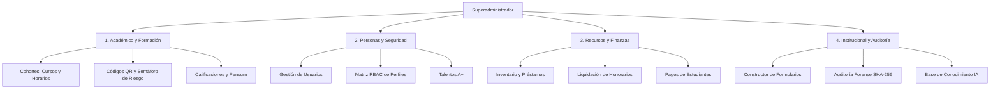
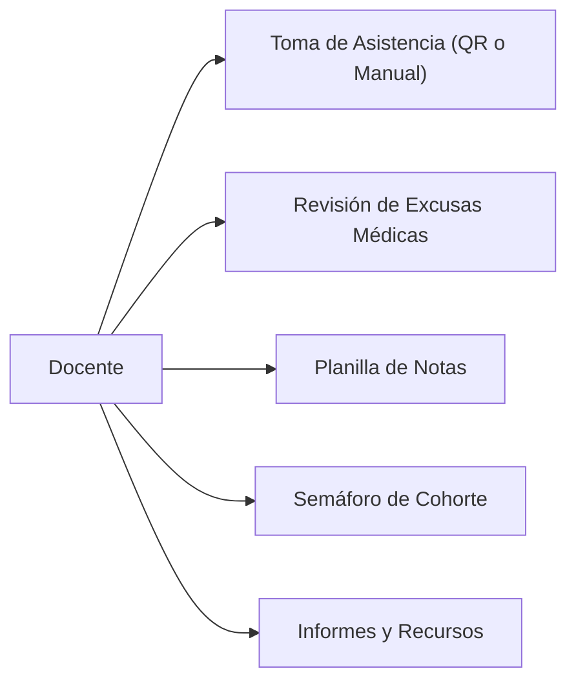
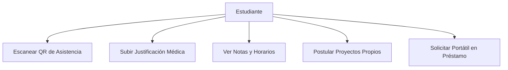

# Manual Oficial de Usuario y Guía de Operaciones del Sistema
## Plataforma Integral de Gestión Académica y Comunitaria — Fundación A+

**Versión:** 1.0 (Edición Producción)  
**Organización:** Fundación A+ (Quibdó, Chocó, Colombia)  
**Programa:** TrAIning de 100 a 1000+  
**Ámbito de Aplicación:** Sitio Público, Portales Administrativos, Docentes, Estudiantes, Aliados y Donantes.

---

## Tabla de Contenido
1. [Introducción y Arquitectura de Roles](#1-introducción-y-arquitectura-de-roles)
2. [Acceso al Sistema y Seguridad de Sesión](#2-acceso-al-sistema-y-seguridad-de-sesión)
3. [Sitio Web Público y Asistente Virtual](#3-sitio-web-público-y-asistente-virtual)
4. [Panel de Superadministrador (Control Maestro)](#4-panel-de-superadministrador-control-maestro)
   - 4.1. [Resumen y Métricas Globales](#41-resumen-y-métricas-globales)
   - 4.2. [Centro de Notificaciones y Comunicados](#42-centro-de-notificaciones-y-comunicados)
   - 4.3. [Gestión Integral de Usuarios](#43-gestión-integral-de-usuarios)
   - 4.4. [Banco de Talentos A+](#44-banco-de-talentos-a)
   - 4.5. [Perfiles y Permisos (Sistema RBAC)](#45-perfiles-y-permisos-sistema-rbac)
   - 4.6. [Módulos y Cohortes Académicas](#46-módulos-y-cohortes-académicas)
   - 4.7. [Cursos y Asignaturas](#47-cursos-y-asignaturas)
   - 4.8. [Gestor de Horarios y Franjas](#48-gestor-de-horarios-y-franjas)
   - 4.9. [Generación de Asistencia por Código QR](#49-generación-de-asistencia-por-código-qr)
   - 4.10. [Semáforo de Riesgo y Alertas Tutoriales](#410-semáforo-de-riesgo-y-alertas-tutoriales)
   - 4.11. [Inventario de Recursos y Préstamo de Equipos](#411-inventario-de-recursos-y-préstamo-de-equipos)
   - 4.12. [Gestión de Pagos y Liquidación de Honorarios](#412-gestión-de-pagos-y-liquidación-de-honorarios)
   - 4.13. [Calificaciones y Evaluaciones](#413-calificaciones-y-evaluaciones)
   - 4.14. [Pensum y Material de Formación](#414-pensum-y-material-de-formación)
   - 4.15. [Proyectos de la Fundación y de Estudiantes](#415-proyectos-de-la-fundación-y-de-estudiantes)
   - 4.16. [Trainee y Entregables Técnicos](#416-trainee-y-entregables-técnicos)
   - 4.17. [Constructor de Formularios Dinámicos](#417-constructor-de-formularios-dinámicos)
   - 4.18. [Memorandos y Reconocimientos](#418-memorandos-y-reconocimientos)
   - 4.19. [Buzón de PQR (Peticiones, Quejas y Reclamos)](#419-buzón-de-pqr-peticiones-quejas-y-reclamos)
   - 4.20. [Auditoría del Sistema y Trazabilidad](#420-auditoría-del-sistema-y-trazabilidad)
   - 4.21. [Base de Conocimiento del Chat IA](#421-base-de-conocimiento-del-chat-ia)
   - 4.22. [Configuración General del Sistema](#422-configuración-general-del-sistema)
5. [Portal del Docente](#5-portal-del-docente)
   - 5.1. [Toma de Asistencia y Sesiones QR](#51-toma-de-asistencia-y-sesiones-qr)
   - 5.2. [Gestión de Justificaciones Médicas y Laborales](#52-gestión-de-justificaciones-médicas-y-laborales)
   - 5.3. [Planilla de Calificaciones](#53-planilla-de-calificaciones)
   - 5.4. [Seguimiento Tutorial y Semáforo](#54-seguimiento-tutorial-y-semáforo)
   - 5.5. [Informes Pedagógicos Mensuales](#55-informes-pedagógicos-mensuales)
   - 5.6. [Solicitud de Equipos y Recursos](#56-solicitud-de-equipos-y-recursos)
   - 5.7. [Agenda y Calendario Personal](#57-agenda-y-calendario-personal)
   - 5.8. [Perfil y Datos Bancarios](#58-perfil-y-datos-bancarios)
6. [Portal del Estudiante](#6-portal-del-estudiante)
   - 6.1. [Registro de Asistencia mediante Escaneo QR](#61-registro-de-asistencia-mediante-escaneo-qr)
   - 6.2. [Envío de Justificaciones de Inasistencia](#62-envío-de-justificaciones-de-inasistencia)
   - 6.3. [Consulta de Calificaciones y Progreso](#63-consulta-de-calificaciones-y-progreso)
   - 6.4. [Horario y Cronograma de Clases](#64-horario-y-cronograma-de-clases)
   - 6.5. [Showcase de Proyectos del Estudiante](#65-showcase-de-proyectos-del-estudiante)
   - 6.6. [Solicitud de Préstamo de Computadores](#66-solicitud-de-préstamo-de-computadores)
   - 6.7. [Agenda y Tareas Personales](#67-agenda-y-tareas-personales)
   - 6.8. [Buzón de PQR del Estudiante](#68-buzón-de-pqr-del-estudiante)
   - 6.9. [Perfil Técnico y Habilidades](#69-perfil-técnico-y-habilidades)
7. [Portal de Aliados e Inversionistas / Donantes](#7-portal-de-aliados-e-inversionistas--donantes)
8. [Procedimientos Operativos Estándar (Paso a Paso)](#8-procedimientos-operativos-estándar-paso-a-paso)

---

## 1. Introducción y Arquitectura de Roles

La plataforma web de la **Fundación A+** es un entorno integrado diseñado para articular los procesos formativos en inteligencia artificial, desarrollo de software y liderazgo comunitario en Quibdó y el Pacífico colombiano.

El sistema implementa una arquitectura de **Control de Acceso Basado en Roles (RBAC)** con validación estricta de tokens JWT, garantizando que cada participante acceda exclusivamente a los datos y acciones que le corresponden:

| Rol | Alcance y Funcionalidades Principales |
| :--- | :--- |
| **Público / Visitante** | Explora la misión institucional, programas, showcase de proyectos, postulación pública y utiliza el Asistente IA de orientación. |
| **Estudiante** | Escanea códigos QR para marcar asistencia, justifica faltas, revisa notas, consulta horarios, postula proyectos, agenda tareas y solicita computadores en préstamo. |
| **Docente** | Genera códigos QR de clase, toma asistencia manual, aprueba excusas médicas, califica talleres, emite informes pedagógicos y registra acompañamiento tutorial. |
| **Administrativo / Coordinador** | Gestiona horarios, inventario de equipos, solicitudes de recursos, comunicados de cohorte y seguimiento académico del semáforo. |
| **Superadministrador** | Control total e irrestricto: administración de cuentas, matriz de perfiles/permisos, finanzas y honorarios, DDL de base de datos, auditoría forense y configuración de servidor. |
| **Aliado Corporativo** | Explora el banco de talentos técnicos, visualiza proyectos comunitarios y monitorea el avance de las cohortes que patrocina sin violar la privacidad individual. |
| **Inversionista / Donante** | Consulta indicadores de impacto social, retención educativa, graduados y evolución de proyectos financiados. |

---

## 2. Acceso al Sistema y Seguridad de Sesión

### Barra Superior (Header) y Modal de Login
En la esquina superior derecha del sitio web público se encuentra el botón principal de acceso:
* **Botón `[Ingresar al Portal]` / `[Iniciar Sesión]`:** Despliega el modal flotante de autenticación.
* **Botón `[Tema Claro/Oscuro]` (Ícono Sol/Luna):** Alterna el contraste de la interfaz entre modo diurno y modo nocturno de alta legibilidad.

### Dentro del Modal de Inicio de Sesión
1. **Selector de Rol / Perfil de Acceso:**  
   Pestañas para seleccionar el tipo de acceso: `Superadmin`, `Administrativo`, `Docente`, `Estudiante`, `Aliado` o `Donante`. *(Nota: Esto ajusta la experiencia visual y valida las credenciales contra la base de datos).*
2. **Campo `Correo Electrónico`:** Ingrese su dirección de correo institucional o personal registrada en el sistema.
3. **Campo `Contraseña`:** Ingrese su contraseña de acceso.
4. **Botón `[Mostrar / Ocultar Contraseña]` (Ícono Ojo):** Permite verificar los caracteres digitados.
5. **Botón `[Ingresar al Sistema]`:** Envía la petición cifrada al endpoint `POST /api/auth/login`. Si las credenciales son válidas, almacena el token firmado en memoria y redirige automáticamente al panel correspondiente.
6. **Botón `[Cerrar]` (Ícono X):** Cierra el formulario modal y regresa a la vista pública.

### Cierre de Sesión Seguro
En la esquina superior derecha de cualquier panel privado se encuentra el avatar del usuario y el botón de salida:
* **Botón `[Cerrar Sesión]` / `[Salir]`:** Elimina el token JWT de la memoria, purga las cookies `HttpOnly` del navegador y redirige inmediatamente al sitio público.
* **Cierre Automático por Inactividad:** Si el usuario permanece 30 minutos sin interacción, la plataforma cierra la sesión de forma preventiva para proteger la privacidad de la información.

---

## 3. Sitio Web Público y Asistente Virtual

### Barra de Navegación del Sitio
* **Botón `[Inicio]`:** Desplaza la pantalla al banner de bienvenida y propuesta de valor de la Fundación A+.
* **Botón `[TrAIning 100 a 1000+]`:** Despliega la información del plan de formación en Python, Inteligencia Artificial y habilidades para la vida.
* **Botón `[Talentos]`:** Muestra la galería pública de perfiles técnicos y proyectos desarrollados por los estudiantes chocoanos.
* **Botón `[Proyectos]`:** Presenta el portafolio de soluciones tecnológicas creadas por la fundación para la región.
* **Botón `[Postulaciones]`:** Redirige al formulario oficial de inscripción si la convocatoria se encuentra abierta.

### Asistente Virtual de Inteligencia Artificial (Widget de Chat)
En la esquina inferior derecha de la pantalla se ubica el botón flotante del asistente:
* **Botón Flotante FAB (Ícono Mensaje):** Abre o contrae la ventana del chat de IA. Incluye un indicador luminoso (*pulse ring*) de disponibilidad del servicio.
* **Botón `[Limpiar Conversación]` (Ícono Papelera):** Borra el historial visual del chat para iniciar una nueva consulta desde cero.
* **Botón `[Cerrar Chat]` (Ícono X):** Minimiza la ventana emergente del asistente.
* **Chips de Sugerencia Rápida:** Botones con preguntas predeterminadas como:
  - *¿Qué es el programa TrAIning?*
  - *¿Cómo postularme a las becas?*
  - *¿Cuáles son los requisitos de asistencia?*
* **Área de Texto `[Escribe tu pregunta...]`:** Campo con límite de 500 caracteres para redactar consultas en lenguaje natural.
* **Botón `[Enviar]` (Ícono Flecha / Avión):** Transmite la consulta al motor de IA en streaming, recibiendo respuestas contextualizadas basadas en la información institucional de la Fundación A+.

---

## 4. Panel de Superadministrador (Control Maestro)

El Superadministrador posee acceso a 22 submódulos operacionales desde el menú lateral izquierdo (*sidebar*).

---

### 4.1. Resumen y Métricas Globales
Pantalla de mando inicial al iniciar sesión como Superadministrador.

* **Tarjetas de KPI Primarias:**
  - *Total Estudiantes Activos:* Conteo en tiempo real de matriculados.
  - *Docentes y Facilitadores:* Personal docente activo.
  - *Asistencia Promedio:* Porcentaje global de presencialidad de la semana.
  - *Cohortes en Curso:* Número de grupos activos en formación.
* **Botón `[Exportar Reporte General]`:** Genera un resumen ejecutivo de las métricas clave del sistema.
* **Botón `[Accesos Rápidos]`:** Atajos de un solo clic para *Crear Usuario*, *Abrir Formulario de Convocatoria* o *Generar Asistencia*.

---

### 4.2. Centro de Notificaciones y Comunicados
Permite enviar avisos oficiales directos o masivos a los portales de estudiantes y docentes.

* **Botón `[Nuevo Comunicado]`:** Abre el modal de redacción institucional.
  - *Campo `Título`:* Encabezado descriptivo del comunicado.
  - *Selector `Tipo`:* `Público` (visible para todos) o `Privado` (solo para cohortes específicas).
  - *Selector `Destinatarios`:* Permite elegir *Todas las cohortes* o seleccionar una cohorte puntual (*ej. Primera Cohorte*).
  - *Selector `Categoría`:* `Académico`, `Institucional`, `Eventos` o `Administrativo`.
  - *Selector `Prioridad`:* `Alta` (borde rojo destacado), `Media` o `Baja`.
  - *Área de Texto `Mensaje`:* Redacción del contenido.
  - *Botón `[Publicar Comunicado]`:** Guarda en MySQL y dispara la notificación reactiva a los usuarios correspondientes.
* **Filtros de Bandeja:** Botones para filtrar por `Todos`, `Académico`, `Institucional` y `No leídos`.
* **Botón `[Marcar como Atendido]` / `[Eliminar]`:** Por cada comunicado, permite archivar la notificación o borrarla de la cartelera general.

---

### 4.3. Gestión Integral de Usuarios
Administración centralizada de todas las cuentas del sistema (Estudiantes, Docentes, Coordinadores, Aliados y Donantes).

* **Botón `[Nuevo Usuario]`:** Despliega el formulario de registro completo:
  - *Campos obligatorios:* Nombre completo, Correo electrónico, Contraseña inicial, Rol (`Estudiante`, `Docente`, `Coordinador`, `Aliado`, `Donante`).
  - *Campos condicionales:* Cohorte asignada (para Estudiantes), Tarifas por hora y datos bancarios (para Docentes), Cohortes autorizadas (para Aliados).
  - *Botón `[Guardar Usuario]`:** Valida unicidad de correo y registra en MySQL con hash bcrypt.
* **Barra de Búsqueda en Vivo:** Campo de texto reactivo que filtra instantáneamente por nombre, correo o documento.
* **Filtros Rápidos por Rol:** Botones tabulares: `[Todos]`, `[Estudiantes]`, `[Docentes]`, `[Administración]`, `[Aliados]`, `[Donantes]`.
* **Acciones en la Fila de Usuario:**
  - **Botón `[Editar]` (Ícono Lápiz):** Abre el modal para actualizar nombres, teléfonos, roles o reasignar de cohorte.
  - **Botón `[Resetear Contraseña]` (Ícono Llave):** Asigna una clave temporal o permite digitar una nueva; incrementa automáticamente `token_version` para invalidar sesiones antiguas abiertas en otros dispositivos.
  - **Botón `[Activar / Desactivar]` (Interruptor de Estado):** Suspende o rehabilita una cuenta sin borrar su historial académico ni financiero.
  - **Botón `[Eliminar]` (Ícono Papelera):** Pide confirmación de seguridad para eliminar permanentemente la cuenta y sus relaciones asociadas.

---

### 4.4. Banco de Talentos A+
Visualización y vitrina del rendimiento de estudiantes y egresados para su conexión con empresas tecnológicas.

* **Filtro de Habilidades Técnicas:** Chips seleccionables para filtrar por `Python`, `React`, `SQL`, `FastAPI`, `Figma`, etc.
* **Selector de Disponibilidad Laboral:** Filtra por `Disponible para Prácticas`, `Contratado` o `En Formación`.
* **Botón `[Ver Ficha Técnica / CV]` en cada tarjeta:** Abre el perfil consolidado con su portafolio de GitHub, repositorio de proyectos y nivel de asistencia.
* **Botón `[Contactar Talento]`:** Abre el cliente de correo preconfigurado para enviar una propuesta de vinculación laboral o mentoría.

---

### 4.5. Perfiles y Permisos (Sistema RBAC)
Matriz de privilegios granulares para definir con exactitud qué puede ver, crear, editar o eliminar cada tipo de usuario.

* **Botón `[Nuevo Perfil]`:** Abre el editor de perfiles personalizados.
  - *Campo `Nombre del Perfil`:* Denominación (*ej. Coordinador de Prácticas*).
  - *Selector `Categoría`:* `Administrativo`, `Docente` o `Estudiante`.
  - *Matriz de Permisos:* Tabla con más de 20 filas (una por módulo) y 4 columnas con casillas de verificación: `[Ver]`, `[Crear]`, `[Editar]`, `[Eliminar]`.
  - *Botón `[Guardar Perfil]`:** Registra el perfil en la base de datos.
* **Acciones en la Tabla de Perfiles:**
  - **Botón `[Editar Permisos]`:** Modifica las casillas activas del perfil.
  - **Botón `[Eliminar Perfil]`:** Elimina perfiles personalizados. *(Nota: Los 3 perfiles maestros del sistema: Docente Estándar, Estudiante Estándar y Administración Estándar tienen este botón deshabilitado para proteger la estabilidad de la plataforma).*

---

### 4.6. Módulos y Cohortes Académicas
Organización de los grupos de formación y sus calendarios de ciclo lectivo.

* **Botón `[Nueva Cohorte]`:** Abre el modal de configuración de cohorte.
  - *Campo `Nombre de la Cohorte`:* Denominación oficial (*ej. Tercera Cohorte - Intensiva*).
  - *Campo `Programa / Especialidad`:* Área de estudio (*ej. Inteligencia Artificial & Fullstack*).
  - *Fechas:* Selector de `Fecha Inicio` y `Fecha Fin`.
  - *Campo `Cupo Máximo`:* Límite de plazas disponibles.
  - *Selector `Estado`:* `En curso`, `Planificada` o `Finalizada`.
  - *Botón `[Crear Cohorte]`:** Confirma y registra en base de datos.
* **Botones por Cohorte:**
  - **Botón `[Ver Estudiantes]`:** Lista los alumnos matriculados en esa cohorte.
  - **Botón `[Colores de Camisa / Identidad]`:** Abre el configurador visual para asignar color distintivo a la cohorte.
  - **Botón `[Editar]`:** Permite prorrogar fechas de entrega o modificar cupos.
  - **Botón `[Cerrar Ciclo]`:** Pasa la cohorte a estado histórico.

---

### 4.7. Cursos y Asignaturas
Catálogo de materias dictadas dentro de los programas de la fundación.

* **Botón `[Nuevo Curso]`:** Modal para registrar asignaturas (*ej. Fundamentos de Python*, *Lógica de Programación*, *Inglés Técnico*).
* **Botón `[Editar Curso]`:** Modifica el título o descripción metodológica.
* **Botón `[Eliminar Curso]`:** Retira la asignatura del catálogo.

---

### 4.8. Gestor de Horarios y Franjas
Planificación semanal de las clases por cohorte y por mes.

* **Selector de Cohorte:** Filtra la vista al grupo específico de estudiantes.
* **Selector de Mes / Periodo:** Selecciona el mes a programar (*ej. 2026-10*).
* **Casilla de Verificación `[Incluir Sábados]`:** Habilita el sexto día de la semana para talleres especiales o tutorías de refuerzo.
* **Botón `[Agregar Franja Horaria]`:**
  - *Día de la Semana:* Lunes a Sábado.
  - *Curso:* Selecciona la materia del catálogo.
  - *Docente:* Selecciona el facilitador asignado.
  - *Horario:* Hora de Inicio y Hora de Finalización.
* **Botón `[Guardar Horario]`:** Persiste la programación en MySQL y genera el registro en la tabla de auditoría horaria.

---

### 4.9. Generación de Asistencia por Código QR
Herramienta de proyección para salón de clases que evita fraudes en la toma de asistencia.

* **Selectores de Configuración:** Selección de Cohorte, Asignatura y Docente a cargo.
* **Botón `[Generar Sesión QR]`:** Crea una sesión activa en `sesiones_asistencia` y proyecta un código QR dinámico de alta resolución.
* **Botón `[Pantalla Completa]` (Ícono Expandir):** Maximiza el código QR para proyectarlo en el televisor o proyector del salón.
* **Botón `[Copiar Enlace Directo]`:** Copia el enlace cifrado con el token de sesión para casos donde la cámara del estudiante tenga averías.
* **Botón `[Cerrar / Finalizar Sesión QR]`:** Da por terminada la ventana de registro presencial. Cualquier intento de escaneo posterior será rechazado.

---

### 4.10. Semáforo de Riesgo y Alertas Tutoriales
Motor predictivo de detección temprana de ausentismo y bajo rendimiento académico.

* **Indicadores de Riesgo:**
  - *Rojo (Crítico):* Asistencia menor al 70% o promedio menor a 6.0.
  - *Amarillo (Alerta):* Asistencia entre 70% y 80% o notas en el umbral de 6.0 a 6.9.
  - *Verde (Al Día):* Asistencia superior al 80% y calificaciones satisfactorias (≥ 7.0).
* **Filtros Rápidos:** Botones `[Todos]`, `[Crítico]`, `[Alerta]`, `[Al Día]`.
* **Botón `[Atender / Acción Tutorial]`:** Abre el modal de intervención:
  - *Tipo de Acción:* Notificación formal, Citación con acudiente, Tutoría de refuerzo, Plan de nivelación.
  - *Diagnóstico y Observaciones:* Resumen de la situación detectada.
  - *Compromiso Acordado:* Metas pactadas con el estudiante.
  - *Fecha Límite:* Plazo para evaluar el cumplimiento.
  - *Botón `[Guardar Acción Tutorial]`:** Notifica al estudiante y guarda en la bitácora de seguimiento.
* **Botón `[Ver Detalle / Ficha]`:** Abre el *Drawer lateral derecho* con el historial completo de notas, faltas clase a clase, justificaciones y registro de acompañamientos previos.

---

### 4.11. Inventario de Recursos y Préstamo de Equipos
Control del parque tecnológico institucional (computadores portátiles, proyectores, periféricos).

* **Pestaña `Catálogo de Recursos`:**
  - **Botón `[Nuevo Recurso]`:** Registra código institucional (*ej. EQ-042*), marca, modelo, número de serie y categoría.
  - **Botones por equipo:** `[Editar Datos]`, `[Reportar en Mantenimiento]`, `[Dar de Baja]`.
* **Pestaña `Bandeja de Solicitudes`:**
  - Muestra peticiones radicadas por docentes o alumnos.
  - **Botón `[Aprobar Solicitud]`:** Abre modal para fijar fecha límite de devolución y persona responsable de la entrega.
  - **Botón `[Rechazar Solicitud]`:** Requiere ingresar el motivo pedagógico o administrativo del rechazo.
* **Pestaña `Asignaciones Activas`:**
  - Lista de equipos actualmente prestados fuera del aula.
  - **Botón `[Registrar Devolución]`:** Cierra el préstamo, registra fecha/hora real de retorno, valida el estado físico del equipo y el custodio institucional que lo recibe.
* **Pestaña `Historial y Trazabilidad`:**
  - Tabla de auditoría histórica inmutable de todos los préstamos pasados con buscador y exportación.

---

### 4.12. Gestión de Pagos y Liquidación de Honorarios
Módulo confidencial para administración financiera de docentes y estudiantes.

* **Submódulo `Honorarios Docentes`:**
  - Lista de docentes con su tarifa por hora pactada.
  - **Botón `[Configurar Datos Bancarios]`:** Registra banco, tipo de cuenta, número y titular.
  - **Botón `[Registrar Pago]`:** Digita fecha, periodo liquidado, número de horas, valor total y campo para cargar comprobante bancario (PDF o imagen).
  - **Botón `[Ver Comprobante]`:** Abre el soporte de transferencia en una pestaña emergente.
* **Submódulo `Pagos y Matrículas de Estudiantes`:**
  - Tabla de control de aportes o cuotas.
  - **Botón `[Validar Pago]`:** Aprueba el recibo consignado por el estudiante.
  - **Botón `[Generar Paz y Salvo]`:** Emite certificación de matrícula al día.

---

### 4.13. Calificaciones y Evaluaciones
Planilla matriz para el consolidado de notas por cohorte y periodo.

* **Selectores:** Cohorte, Curso y Mes.
* **Matriz de Estudiantes:** Celdas numéricas con validación de rango (0.0 a 10.0).
* **Cálculo Automático:** La plataforma computa el promedio en tiempo real y colorea en verde (aprobado ≥ 6.0) o rojo (reprobado < 6.0).
* **Botón `[Guardar Calificaciones]`:** Envía los cambios al backend PHP para persistencia en `notas_modulos`.
* **Botón `[Exportar Planilla Excel]`:** Descarga el listado consolidado para archivo físico o reportes a secretaría.

---

### 4.14. Pensum y Material de Formación
Gestor de contenido pedagógico y guías de autoaprendizaje.

* **Botón `[Nuevo Módulo del Pensum]`:** Crea un bloque temático (*ej. Módulo 3: APIs REST y FastAPI*).
* **Botón `[Agregar Recurso / Enlace]`:** Vincula documentos PDF institucionales, repositorios de GitHub, videos explicativos o laboratorios.
* **Botones `[Subir / Bajar Orden]`:** Reorganiza la secuencia pedagógica de los módulos.
* **Botón `[Eliminar Bloque]`:** Suprime contenido desactualizado con confirmación previa.

---

### 4.15. Proyectos de la Fundación y de Estudiantes
Showcase y portafolio de impacto tecnológico regional.

* **Botón `[Nuevo Proyecto Fundación]`:**
  - *Campos:* Título, resumen ejecutivo, tecnologías, repositorio, enlace en vivo, imagen de portada y estado (*En incubación*, *Desarrollo activo*, *En producción*, *Escalado regional*).
  - *Botón `[Guardar Proyecto]`:** Publica en la base de datos.
* **Proyectos de Estudiantes (Revisión y Aprobación):**
  - Los estudiantes proponen iniciativas tecnológicas.
  - **Botón `[Aprobar para Vitrina Pública]`:** Hace visible el proyecto en la sección pública de Talentos A+.
  - **Botón `[Enviar Feedback Técnico]`:** Envía comentarios de mejora al estudiante antes de su publicación.

---

### 4.16. Trainee y Entregables Técnicos
Bandeja de recepción de código fuente, tareas y desafíos técnicos.

* **Filtro por Estudiante y Cohorte:** Localiza entregas puntuales.
* **Botón `[Descargar Archivo]` / `[Abrir Repositorio GitHub]`:** Acceso directo a la solución enviada por el alumno.
* **Botón `[Emitir Calificación y Comentarios]`:** Guarda la evaluación pedagógica del entregable.

---

### 4.17. Constructor de Formularios Dinámicos
Módulo de creación de convocatorias, encuestas y formularios de postulación sin necesidad de código.

* **Botón `[Crear Formulario]`:** Modal de configuración general:
  - Título, slug de URL pública (*ej. #formulario/becas-2027*), descripción, fecha de apertura y fecha de cierre.
  - Límite de respuestas por usuario o por dirección IP.
* **Constructor de Campos (Botón `[+ Agregar Pregunta]`):**
  - Tipos disponibles: `Texto corto`, `Párrafo`, `Número`, `Correo electrónico`, `Menú desplegable`, `Casillas múltiples` o `Subida de archivo`.
  - Interruptor `Obligatoria`: Exige el diligenciamiento antes de enviar.
* **Bandeja de Respuestas:**
  - **Botón `[Ver Respuestas]`:** Tabla en tiempo real con las postulaciones radicadas.
  - **Botón `[Exportar a CSV / Excel]`:** Descarga la base de datos de postulantes para análisis.
  - **Botón `[Archivar Formulario]`:** Cierra la recepción y lo traslada a la papelera.

---

### 4.18. Memorandos y Reconocimientos
Gestión de comunicaciones oficiales y distinciones al mérito.

* **Botón `[Emitir Memorando]`:**
  - Selector de Destinatario: Docente o Estudiante.
  - Tipo: `Felicitación / Reconocimiento`, `Llamado de atención` o `Notificación institucional`.
  - Asunto y contenido detallado.
  - **Botón `[Firmar y Enviar]`:** Despacha la notificación oficial al perfil del destinatario.
* **Botón `[Ver Confirmación de Lectura]`:** Permite verificar la fecha y hora en que el destinatario abrió y leyó el documento.

---

### 4.19. Buzón de PQR (Peticiones, Quejas y Reclamos)
Módulo de atención al usuario y resolución de inquietudes de la comunidad.

* **Filtros por Estado:** `[Pendientes]`, `[En Trámite]`, `[Resueltos]`.
* **Botón `[Abrir Ticket]`:** Muestra el historial completo de la solicitud y los mensajes previos.
* **Área de Respuesta y Botón `[Enviar Respuesta]`:** Responde formalmente al estudiante o docente vía web y correo electrónico.
* **Botón `[Marcar como Resuelto]`:** Cierra el ticket de atención.

---

### 4.20. Auditoría del Sistema y Trazabilidad
Módulo forense para cumplimiento de normas de seguridad de la información.

* **Pestaña `Inicios de Sesión (Logins)`:**
  - Registra fecha, hora exacta, correo, dirección IP, resultado (`Exitoso` / `Fallido`) y *Hash de Integridad SHA-256*.
* **Pestaña `Acciones Administrativas`:**
  - Registra cualquier creación, edición o eliminación de registros, indicando el usuario ejecutor y los valores alterados.
* **Pestaña `Auditoría de Horarios`:**
  - Muestra cambios en franjas horarias con valor anterior vs. valor nuevo.
* **Botón `[Exportar Registro de Auditoría]`:** Descarga los logs forenses.

---

### 4.21. Base de Conocimiento del Chat IA
Panel para alimentar el asistente virtual con preguntas frecuentes y directrices institucionales sin tocar código.

* **Botón `[Nueva Entrada de Conocimiento]`:**
  - *Campo `Título`:* Tema (*ej. Requisitos para graduación en TrAIning*).
  - *Área de Texto `Contenido`:* Explicación detallada con datos precisos que el bot utilizará para responder.
  - *Selector `Visibilidad`:* `Pública` (cualquier visitante) o `Solo usuarios con sesión` (información interna).
  - *Botón `[Guardar en Base de Datos]`:** Actualiza la tabla `chat_voz_conocimiento` para consumo inmediato del modelo de lenguaje.
* **Botones por Registro:** `[Editar]`, `[Pausar / Desactivar]`, `[Eliminar]`.

---

### 4.22. Configuración General del Sistema
Parámetros del núcleo de la plataforma.

* **Datos Institucionales:** Nombre oficial de la fundación, dirección en Quibdó, teléfonos de contacto y correo institucional.
* **Reglas Académicas Globales:**
  - *Nota Mínima de Aprobación:* Umbral mínimo (predeterminado `6.0`).
  - *Porcentaje de Asistencia Mínima:* Porcentaje obligatorio (predeterminado `80%`).
* **Configuración del Servidor SMTP (Correo):**
  - Servidor SMTP (*ej. smtp.gmail.com*), Puerto (*465* o *587*), Usuario, Contraseña de aplicación y Correo remitente.
* **Botón `[Probar Envío de Correo]`:** Valida la conexión SMTP enviando un mensaje de prueba seguro.
* **Botón `[Guardar Configuración General]`:** Aplica los cambios en la base de datos de producción.

---

## 5. Portal del Docente

El docente cuenta con una interfaz simplificada orientada a la labor en el aula de clases.

### 5.1. Toma de Asistencia y Sesiones QR
* **Selector de Cohorte y Materia:** Elige la clase activa del día.
* **Botón `[Iniciar Asistencia QR]`:** Genera el código QR proyectable en el aula.
* **Planilla Manual de Estudiantes:** Si un estudiante no tiene celular o falla la cámara, el docente dispone de 4 botones por alumno:
  - **Botón `[P]` (Verde):** Marca `Presente`.
  - **Botón `[T]` (Amarillo):** Marca `Tarde` (llegada con retraso justificado).
  - **Botón `[F]` (Rojo):** Marca `Falla` (inasistencia no justificada).
  - **Botón `[J]` (Azul):** Marca `Justificada`.
* **Botón `[Guardar Asistencia de la Clase]`:** Guarda los estados en el servidor y sincroniza el semáforo académico.

### 5.2. Gestión de Justificaciones Médicas y Laborales
* **Bandeja de Justificaciones:** Muestra solicitudes radicadas por estudiantes de sus asignaturas.
* **Botón `[Ver Soporte Adjunto]`:** Abre el certificado médico o carta laboral cargada por el estudiante.
* **Botón `[Aceptar Justificación]`:** Convierte automáticamente la *Falla* previa en *Justificada* y recalcula la presencialidad del estudiante.
* **Botón `[Rechazar Justificación]`:** Mantiene la inasistencia y permite enviar un motivo al alumno.

### 5.3. Planilla de Calificaciones
* **Selectores:** Cohorte, Asignatura y Mes evaluado.
* **Inputs de Notas:** Campos para registrar calificaciones de talleres y proyectos.
* **Botón `[Guardar Calificaciones]`:** Actualiza las notas definitivas en la base de datos.

### 5.4. Seguimiento Tutorial y Semáforo
* **Lista de Estudiantes de su Cohorte:** Muestra los semáforos de riesgo de sus alumnos.
* **Botón `[Ver Ficha del Estudiante]`:** Consulta el récord histórico del alumno.
* **Botón `[Registrar Observación / Alerta]`:** Radica novedades conductuales o académicas para intervención del equipo de coordinación.

### 5.5. Informes Pedagógicos Mensuales
* **Botón `[Nuevo Informe Mensual]`:** Abre la plantilla de reporte docente:
  - Contenidos avanzados, porcentaje de cumplimiento del pensum, alumnos destacados y estudiantes que requieren refuerzo.
  - **Botón `[Radicar Informe a Coordinación]`:** Envía el informe oficial a los administradores.

### 5.6. Solicitud de Equipos y Recursos
* **Botón `[Solicitar Computador o Proyector]`:** Formulario para requerir recursos pedagógicos con fecha requerida y aula.
* **Botón `[Enviar Solicitud]`:** Pone la petición en la bandeja del Superadministrador.

### 5.7. Agenda y Calendario Personal
* **Botón `[Agregar Evento / Tarea]`:** Registra compromisos en su calendario docente (reuniones de área, entregas de notas).
* **Botón `[Eliminar Evento]`:** Borra recordatorios finalizados.

### 5.8. Perfil y Datos Bancarios
* **Campos de Cuenta Bancaria:** Permite registrar su certificación para la liquidación mensual de honorarios.
* **Botón `[Actualizar Perfil]`:** Guarda los datos en el sistema.

---

## 6. Portal del Estudiante

El portal del estudiante está optimizado para dispositivos móviles y computadores portátiles.

### 6.1. Registro de Asistencia mediante Escaneo QR
* **Botón `[Escanear Código QR]`:** Activa de forma segura la cámara trasera o frontal del dispositivo del estudiante.
* **Cuadro de Enfoque:** El estudiante apunta la cámara al código QR proyectado por el profesor.
* **Confirmación Inmediata:** La plataforma valida el token, verifica que la sesión esté abierta y muestra un mensaje de confirmación en verde: *«¡Asistencia Registrada con Éxito!»*.
* **Botón `[Cerrar Escáner]`:** Apaga la cámara del dispositivo.

### 6.2. Envío de Justificaciones de Inasistencia
* **Botón `[Radicar Justificación]`:** Abre el modal de soporte:
  - *Selector `Fecha de la Inasistencia`:* Permite escoger el día de la falta.
  - *Selector `Motivo`:* `Cita Médica / Incapacidad`, `Fuerza Mayor`, `Calamidad Doméstica` o `Laboral`.
  - *Área de Texto `Explicación`:* Detalle de lo sucedido.
  - *Botón `[Adjuntar Soporte (PDF / Imagen)]`:* Carga el archivo o fotografía de la incapacidad.
  - *Botón `[Enviar Justificación]`:* Remite la solicitud directamente al profesor y al coordinador.

### 6.3. Consulta de Calificaciones y Progreso
* **Visualización de Materias:** Tarjetas con el estado de cada curso.
* **Promedio Ponderado:** Muestra el promedio acumulado y el estado de aprobación (Verde: ≥ 6.0 | Rojo: < 6.0).
* **Botón `[Ver Retroalimentación del Docente]`:** Despliega las observaciones pedagógicas dejadas por el profesor en cada entrega.

### 6.4. Horario y Cronograma de Clases
* **Calendario Dinámico:** Consulta de materias, horas, docentes y salones correspondientes a su cohorte.
* **Botones `[Mes Anterior]` y `[Mes Siguiente]`:** Permite navegar en el historial y planificar las semanas venideras.

### 6.5. Showcase de Proyectos del Estudiante
* **Botón `[Registrar Mi Proyecto]`:**
  - Nombre de la aplicación o iniciativa, descripción del problema que soluciona en el Chocó, tecnologías utilizadas, enlace al repositorio de GitHub y enlace al despliegue en vivo (demo).
  - **Botón `[Guardar Proyecto]`:** Registra en la plataforma.
* **Botón `[Editar Proyecto]`:** Actualiza enlaces o capturas del avance.
* **Botón `[Solicitar Publicación en Talentos A+]`:** Solicita la aprobación administrativa para que el proyecto aparezca en la vitrina pública frente a aliados.

### 6.6. Solicitud de Préstamo de Computadores
* **Botón `[Solicitar Préstamo de Equipo]`:**
  - Motivo de la solicitud (*ej. Práctica de desarrollo web en casa*, *Laboratorio extracurricular*).
  - Periodo requerido (días solicitados).
  - **Botón `[Radicar Solicitud]`:** Pone el requerimiento en consideración del administrador.
* **Indicador de Estado:** La tarjeta del estudiante refleja si su petición está en `Pendiente`, `Aprobada para Recoger` o `En Préstamo`.

### 6.7. Agenda y Tareas Personales
* **Botón `[Nueva Tarea / Recordatorio]`:** Permite organizar entregas de código y sesiones de estudio.
* **Botón `[Eliminar]`:** Limpia tareas cumplidas de la lista personal.

### 6.8. Buzón de PQR del Estudiante
* **Botón `[Radicar Solicitud / PQR]`:** Canal directo y confidencial para solicitar certificados, soporte técnico o reportar novedades de convivencia.
* **Botón `[Ver Respuesta]`:** Permite consultar la solución emitida por el equipo de coordinación.

### 6.9. Perfil Técnico y Habilidades
* **Editor de Biografía:** Espacio para presentarse ante mentores y empresas aliadas.
* **Gestor de Habilidades Técnicas (Skills):**
  - Botón para agregar etiquetas (*tags*) técnicas: `Python`, `Django`, `PostgreSQL`, `TailwindCSS`, `Git`, etc.
* **Botón `[Guardar Perfil]`:** Actualiza la ficha técnica del estudiante en la base de datos.

---

## 7. Portal de Aliados e Inversionistas / Donantes

Diseñado para organizaciones que apoyan financieramente o contratan el talento de la Fundación A+.

### Características y Botones
* **Resumen de Impacto Comunitario:** Métricas de jóvenes capacitados, distribución por género y porcentaje de retención en el programa TrAIning.
* **Explorador de Talentos Técnicos:** Buscador de estudiantes aptos para contratación o pasantías:
  - **Botón `[Filtrar por Stack Tecnológico]`:** Segmenta por especialidad.
  - **Botón `[Ver Portafolio de Código]`:** Visualiza proyectos reales sin exponer datos sensibles de contacto no autorizados.
  - **Botón `[Vincular a Proceso de Selección]`:** Notifica al equipo de alianzas para coordinar entrevistas técnicas.
* **Rendimiento de Cohortes Patrocinadas:** Muestra el desempeño académico agrupado de los grupos beneficiarios de becas corporativas bajo el esquema de seguridad **IDOR Scoping** (`cohortes_permitidas`), garantizando que la empresa solo visualice el rendimiento de las cohortes que patrocina.

---

## 8. Procedimientos Operativos Estándar (Paso a Paso)

### Procedimiento 1: Toma de Asistencia en el Salón de Clases
1. El **Docente** ingresa a su portal con correo y contraseña.
2. Hace clic en el menú lateral en **`Toma de Asistencia`**.
3. Selecciona la cohorte y la materia del día.
4. Hace clic en **`[Iniciar Asistencia QR]`** y activa el botón de **`[Pantalla Completa]`** para proyectar el código en el televisor o pared del salón.
5. Los **Estudiantes** abren la plataforma en sus teléfonos móviles, inician sesión, van a **`Asistencia`** y presionan **`[Escanear Código QR]`**.
6. Apuntan la cámara al proyector; el sistema registra la presencialidad en menos de un segundo y emite el mensaje verde de éxito.
7. Al concluir los 15 minutos de tolerancia, el docente presiona **`[Cerrar Sesión QR]`**.
8. Si algún estudiante llegó tarde o no disponía de cámara, el profesor ubica su nombre en la lista manual y presiona **`[T]`** (Tarde) o **`[P]`** (Presente) y finaliza con **`[Guardar Asistencia de la Clase]`**.

---

### Procedimiento 2: Subir y Aprobar una Justificación Médica
1. El **Estudiante** ingresa a su portal, va a **`Asistencia`** y hace clic en **`[Radicar Justificación]`**.
2. Selecciona la fecha en la que faltó, el motivo (*Cita Médica*), redacta la explicación y adjunta la foto de la constancia. Presiona **`[Enviar Justificación]`**.
3. El **Docente** (o Superadmin) ingresa a su panel y abre la pestaña **`Justificaciones Pendientes`**.
4. Presiona **`[Ver Soporte]`** para examinar el documento médico.
5. Si el soporte es válido, presiona **`[Aceptar Justificación]`**. La plataforma retira la penalización en el semáforo y actualiza la base de datos a estado *Justificada*.

---

### Procedimiento 3: Préstamo y Devolución de un Computador Portátil
1. El **Estudiante** va a **`Equipos y Recursos`** y presiona **`[Solicitar Préstamo de Equipo]`**. Describe el motivo de estudio y envía la solicitud.
2. El **Superadministrador** ingresa a **`Bandeja de Solicitudes de Recursos`**.
3. Revisa la disponibilidad de computadores en el catálogo y presiona **`[Aprobar Solicitud]`**. Selecciona el equipo exacto (*ej. EQ-012*), define la fecha máxima de retorno y confirma la entrega.
4. El equipo pasa automáticamente a estado *«En Préstamo»* en el inventario.
5. Al cumplirse el plazo, el estudiante entrega físicamente la máquina en la sede.
6. El Superadministrador entra a **`Asignaciones Activas`**, ubica el registro y presiona **`[Registrar Devolución]`**. Valida que el equipo esté en buen estado, selecciona su nombre como custodio receptor y confirma. El equipo regresa a estado *«Disponible»* en el inventario.

---

### Procedimiento 4: Gestión de Alertas Tempranas en el Semáforo Académico
1. El **Superadministrador** o **Docente** ingresa a **`Semáforo`**.
2. Identifica a los estudiantes marcados en **Rojo (Crítico)**.
3. Presiona **`[Ver Detalle]`** para revisar el reporte de inasistencias y bajas calificaciones en el Drawer lateral.
4. Presiona **`[Atender / Acción Tutorial]`**.
5. Selecciona la acción (*Notificación formal de inasistencia* o *Tutoría pedagógica*), ingresa el diagnóstico, establece el compromiso y define la fecha límite de revisión.
6. Presiona **`[Guardar Acción Tutorial]`**. El estudiante recibe una notificación formal de acompañamiento en su portal y se genera trazabilidad institucional en la bitácora tutorial.

---

### Procedimiento 5: Registro y Liquidación de Honorarios a Docentes
1. El **Docente** ingresa a **`Mi Perfil`** y completa los datos de su cuenta bancaria.
2. Finalizado el mes, el **Superadministrador** ingresa al submódulo **`Pagos y Liquidación`** -> **`Honorarios Docentes`**.
3. Presiona **`[Registrar Pago]`** en la fila del docente.
4. Verifica el número de horas dictadas según los registros de horarios y asistencia.
5. Digita el monto liquidado, adjunta el comprobante de transferencia bancaria y presiona **`[Guardar Pago]`**.
6. El pago queda registrado en la contabilidad y el comprobante permanece disponible para consulta y descarga tanto del administrador como del docente.

---

*Manual elaborado y verificado para la Fundación A+. Todos los módulos, endpoints y componentes operan sobre arquitectura relacional MySQL y frontend modular JavaScript.*
